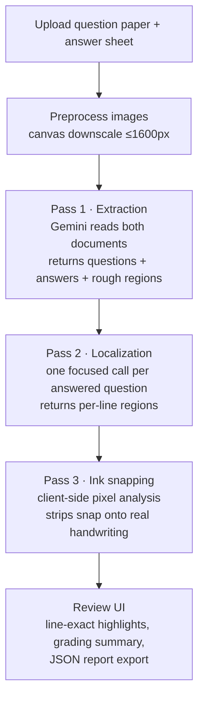

# VedaAI · AI Assessment Review

Upload a question paper and a student's answer sheet — the app extracts every question, maps each
answer to its question, **highlights the exact handwritten lines on the answer sheet**, and produces
a grading summary with per-question AI feedback and an exportable JSON report.

Built with **React 19 + Vite**, graded by **Gemini 2.5 Flash** (via OpenRouter), with a custom
**deterministic ink-snapping engine** that makes the highlights pixel-accurate.

---

## Table of contents

1. [What it does](#what-it-does)
2. [Features](#features)
3. [Tech stack](#tech-stack)
4. [Getting started](#getting-started)
5. [How it works — the full pipeline](#how-it-works--the-full-pipeline)
   - [Step 0 · File preprocessing](#step-0--file-preprocessing)
   - [Step 1 · Extraction pass](#step-1--extraction-pass)
   - [Step 2 · Localization pass](#step-2--localization-pass)
   - [Step 3 · Ink snapping (the accuracy layer)](#step-3--ink-snapping-the-accuracy-layer)
   - [Coordinate system](#coordinate-system)
6. [Rendering & fallback chain](#rendering--fallback-chain)
7. [Project structure](#project-structure)
8. [Environment variables](#environment-variables)
9. [Error handling](#error-handling)
10. [Known limitations](#known-limitations)

---

## What it does

Manual paper checking is slow and error-prone: the checker keeps flipping between the question
paper and a stack of answer sheets, hunting for which response belongs to which question.

This app automates that loop:

```
┌────────────────┐      ┌─────────────────┐      ┌───────────────────────┐
│ Question paper │  +   │ Answer sheet    │  →   │ Graded review board   │
│ (PDF / image)  │      │ (PDF / image)   │      │ with exact highlights │
└────────────────┘      └─────────────────┘      └───────────────────────┘
```

- Every printed question is extracted **in original order**, including labelled sub-parts like `11(a)`.
- Each written answer is matched to its question **even when answered out of order**.
- The student's actual handwriting for each answer is **highlighted line-by-line directly on the
  uploaded sheet image** — only the written words, never empty space or neighbouring answers.
- Marks, correctness verdicts (`correct` / `partially_correct` / `incorrect`), per-question feedback,
  an overall score summary, and unmatched answers are surfaced in one review screen.
- The whole assessment can be exported as a structured JSON report.

## Features

| Area | Details |
| --- | --- |
| Upload | Drag-and-drop or browse; PDF / JPG / PNG up to 20 MB; large images auto-downscaled |
| Extraction | Ordered questions, max marks, transcribed answers, status flags |
| Mapping | Out-of-order matching, unmatched-answer detection, "needs review" flagging |
| Highlighting | Per-line strips snapped onto real ink pixels (see [ink snapping](#step-3--ink-snapping-the-accuracy-layer)) |
| Review UI | Question list with filters, answer viewer with page info + confidence, AI insight banner |
| Export | One-click `assessment-report.json` download |

## Tech stack

| Layer | Choice | Why |
| --- | --- | --- |
| UI | React 19 (+ React Compiler) | Modern concurrent rendering, fewer manual memo optimizations |
| Build | Vite 8 | Instant HMR during development |
| Styling | Hand-written CSS (custom properties) | Zero runtime cost, full control over the design system |
| Vision AI | `google/gemini-2.5-flash` via OpenRouter | Strong document vision + cheap/fast enough for multi-pass calls |
| Canvas API | Native browser APIs | Image decoding, adaptive thresholding, region profiling — all client-side |

## Getting started

```bash
git clone https://github.com/ashuifh/Assignment_01.git
cd Assignment_01
npm install
```

Create a `.env` file in the project root:

```ini
VITE_OPENROUTER_API_KEY=sk-or-v1-your-key-here
```

> Get a key from <https://openrouter.ai/keys>. Requests are proxied through the Vite dev server so
> the key stays server-side during development.

```bash
npm run dev      # start at http://localhost:5173
npm run build    # production build → dist/
npm run lint     # eslint
```

### Using the app

1. Drag the **question paper** into the left box and the **answer sheet** into the right (or click to browse).
2. Press **Start extraction** — the banner tracks progress while the three passes run.
3. Click any question in the sidebar: its handwritten lines are highlighted exactly on the sheet preview.
4. Watch the metric cards for totals, per-question status (`answered` / `needs review` / `unanswered`), and the AI insight banner for overall feedback.
5. **Export report** downloads the full structured assessment as `assessment-report.json`.

---

## How it works — the full pipeline



### Step 0 · File preprocessing

`src/services/aiService.js`

- Files are read as data URLs so they can be embedded directly into the multimodal prompt.
- **Images larger than 2 MB are downscaled** through a canvas so their longest side is ≤ 1600 px and
  re-encoded as JPEG quality 0.78.
  *Why:* vision models bill by tokens; a 4000 px phone photo wastes tokens without adding readable
  detail, and uploads get faster too.

### Step 1 · Extraction pass

One call sends **both documents** (question paper + answer sheet) to Gemini with a strict JSON
contract (`response_format: json_object`, `temperature: 0.1` for determinism):

```json
{
  "questions": [{
    "id": "stable unique id",
    "number": "original printed number incl. subpart e.g. 11(a)",
    "text": "question text",
    "maxMarks": 5,
    "earnedMarks": 4,
    "answerId": "matched answer id",
    "status": "answered | review | unanswered",
    "correctness": "correct | partially_correct | incorrect | unknown",
    "feedback": "evidence-based comment",
    "confidence": 0.92,
    "answer": "transcribed handwritten text",
    "page": 1,
    "lines": [{ "x": 0.12, "y": 0.34, "width": 0.5, "height": 0.02 }],
    "box": { "x": 0.1, "y": 0.32, "width": 0.55, "height": 0.09 }
  }],
  "unmatchedAnswers": ["…written answers that fit no question…"],
  "summary": { "totalMarks": 40, "score": 31, "feedback": "…" }
}
```

Key rules enforced by the prompt:

- preserve printed order; split labelled parts (`11(a)` becomes its own row);
- mark `unanswered` when no written response exists, `review` when mapping confidence is low;
- anything written that matches no question lands in `unmatchedAnswers`;
- grade **only** when the paper provides enough evidence — otherwise `null` / `unknown`, never guessed.

### Step 2 · Localization pass

The extraction pass sees two documents at once, so its region estimates are coarse. For **each**
answered question a second, tightly-scoped call goes out containing *only the answer sheet* plus:

- the question number and text,
- the already-transcribed answer text,

and instructions to return **one strip per handwritten line**, first word to last word, excluding
printed text, margins, ruled lines, and neighbouring answers.

*Why this helps:* giving the model one job (find *this specific text* on *this one page*) is far more
reliable than asking it to segment everything in a single shot.

### Step 3 · Ink snapping (the accuracy layer)

`src/services/refineHighlights.js` — the part that makes highlighting **exact**.

Vision-model coordinates are always approximate: boxes drift a few percent, cover blank space, or
skip a line. So the model's rectangles are demoted to *hints*, and the browser snaps them onto the
real handwriting:

```
AI rectangle (hint)
   ↓ expand search zone ±2% width, ±16% height
Bradley adaptive threshold → binary ink mask
   ↓ row profile inside zone
horizontal text bands (one per written line)
   ↓ paragraph gap-join
recover missed lines of the same answer
   ↓ column trim per band
strip = exactly first-word → last-word extent
   ↓ normalize back to 0..1
final highlight rectangles
```

**1. Adaptive thresholding (not a fixed cut-off).**
A naive "pixel is dark ⇒ it's ink" rule breaks on phone photos with shadows. Instead the classic
**Bradley integral-image threshold**: a pixel counts as ink only if it is clearly darker than the
*local mean* of its neighbourhood (window radius = ⅙ of the smaller dimension, factor × 0.86).
Faint blue ruled lines and uneven lighting stay background; pen strokes stand out everywhere.

**2. Row profiling → line bands.**
Inside the hint's expanded zone we count ink pixels per pixel-row. Rows above
`max(3, 6% of peak count)` form horizontal bands — one band ≈ one line of handwriting.

**3. Paragraph gap-join (recovers what the model missed).**
The vertical gap between consecutive bands is measured; its **median** approximates the line spacing
of *this particular paragraph*. Bands above/below the hint are absorbed while the gap stays under
`median × 1.7`. Result: a line the model skipped gets included, but absorption stops at the much
larger gap before the next question — neighbours are never swallowed.

**4. Column trimming (kills empty space).**
For each band, ink pixels are counted per column and the strip is cut to the first and last column
above threshold (plus ~0.2% padding). This is why highlights start at the first written word and end
at the last — no leading indent space, no trailing margin.

**5. Ruled-line rejection.**
A band thinner than ~0.4% of page height whose ink spans >82% of the window continuously is a ruled
notebook line, not handwriting — discarded.

If snapping finds nothing usable (e.g. a very unusual scan), the UI silently falls back to the raw
model regions — the feature degrades gracefully instead of breaking.

### Coordinate system

- All regions are **normalized `0..1` floats relative to the full sheet image** — resolution-independent,
  so they render correctly at any preview size.
- Models occasionally drift back to Gemini's native **0–1000** box scale despite the prompt, so every
  incoming rectangle passes through a normalizer: if any coordinate exceeds 1.5 the whole rect is
  treated as 0–1000 scale and divided down; everything is then **clamped into `[0,1]`** (a rect poking
  slightly past the page edge is trimmed, never rejected).

## Rendering & fallback chain

`src/components/AnswerViewer.jsx` overlays absolutely-positioned strips on the sheet preview:

```
snapped ink strips (exact) → AI per-line strips → single AI box → no highlight (status: review)
```

Snapped strips use `mix-blend-mode: multiply`, so the yellow behaves like a real highlighter — the
handwriting underneath stays fully readable. While the snap computation runs (a few tens of ms),
the AI strips show immediately; the swap is seamless.

State lives in the `useAssessment` hook (`src/hooks/useAssessment.js`): files, extracted questions,
summary, active selection, processing/error flags — the three presentational components stay pure.

## Project structure

```
src/
├── App.jsx                     # layout shell, export-report handler
├── App.css                     # design system + all component styles
├── components/
│   ├── UploadSection.jsx       # drag-and-drop file inputs
│   ├── ProcessingStatus.jsx    # spinner banner / error banner
│   ├── GradingSummary.jsx      # metric cards + AI insight banner
│   ├── QuestionList.jsx        # sidebar list, review filter, unmatched note
│   └── AnswerViewer.jsx        # sheet preview + highlight overlays + footer
├── hooks/
│   └── useAssessment.js        # all app state + orchestration
└── services/
    ├── aiService.js            # OpenRouter calls, prompts, coordinate normalization
    └── refineHighlights.js     # ink detection & snapping engine (pure core + DOM loader)
```

## Environment variables

| Variable | Required | Description |
| --- | --- | --- |
| `VITE_OPENROUTER_API_KEY` | yes | OpenRouter API key used for the Gemini calls |

The dev server proxies `/api/openrouter/*` → `https://openrouter.ai/api/v1/*`
(see `vite.config.js`), which avoids CORS issues and keeps the key out of client-side network logs.

## Error handling

| Case | Behaviour |
| --- | --- |
| Missing API key | Clear setup error before any network call |
| OpenRouter / model errors | Status + message surfaced in a red banner; files kept staged |
| Malformed model JSON | Code-fence stripping + strict parse; failure marks affected questions `review` |
| Invalid coordinates | Scale-corrected, clamped, or rejected individually — one bad rect never kills the run |
| Unreadable image | Snapping skipped, AI regions shown as-is |

## Known limitations

- PDF answer sheets show a text-preview panel rather than a rendered page (no pdf.js yet), so exact
  visual highlighting applies to **image** sheets.
- Very low-contrast pencil on grey paper can drop below the ink threshold.
- Multi-page PDFs rely on the model reporting the correct page number.

---

Made as a semester assignment demonstrating a practical **AI + computer-vision hybrid**: let the LLM
do semantic work (reading, matching, grading) and deterministic image processing do geometric work
(pixel-exact localization). Neither alone is sufficient; together they produce highlights that are
actually trustworthy.
